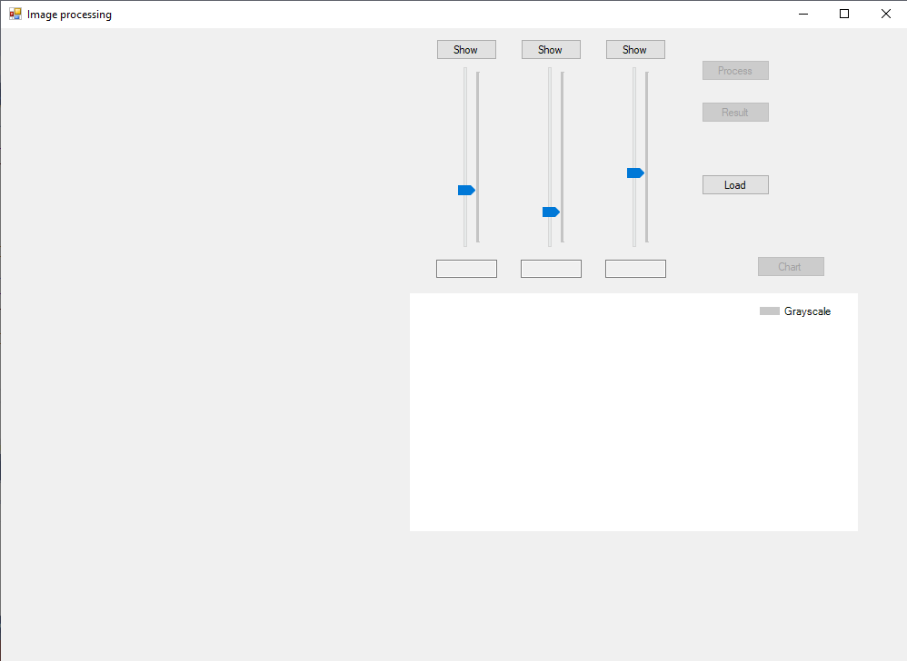

# Image-processing
Digital image processing on C# (desktop application)

This program is written using .NET Framework.

<h3>Here are examples of how this application works:</h3>

<strong>So here is the final result:</strong>

